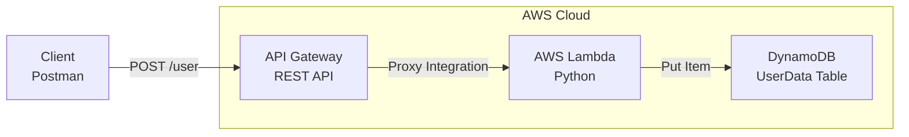
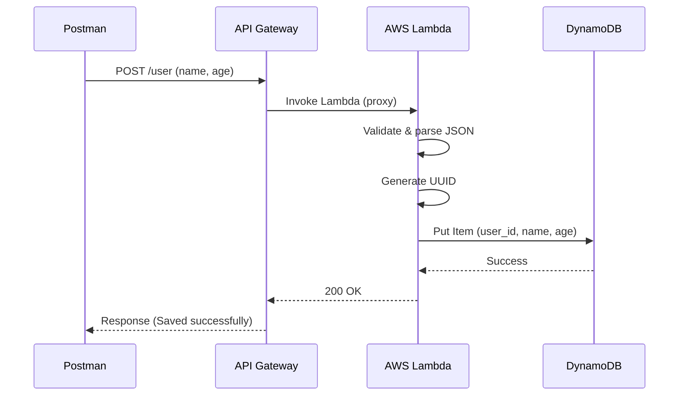

# 🚀 Terraform Serverless User API on AWS

An end-to-end serverless REST API built on AWS using Terraform (Infrastructure as Code).
This project provisions and deploys a backend system using API Gateway, AWS Lambda, and DynamoDB.

---

## 📌 Project Overview

This API accepts user data (name and age) via an HTTP POST request and stores it in a DynamoDB table.

Key highlights:
- 100% Infrastructure as Code (Terraform)
- Serverless and scalable
- No hardcoded credentials
- Industry-style AWS architecture

---

## 🏗️ Architecture Diagram



---

## 🔄 Workflow (Request Lifecycle)



---

## 🛠️ Tech Stack

- Terraform
- AWS Lambda (Python 3.12)
- Amazon API Gateway (REST)
- Amazon DynamoDB
- AWS IAM
- Git & GitHub
- Postman

---

## 📁 Project Structure (Explained)

```bash
terraform-user-api/
│
├── provider.tf           # AWS provider & region configuration
├── iam.tf                # IAM role & policies for Lambda
├── dynamodb.tf           # DynamoDB table definition (UserData)
├── lambda.tf             # Lambda function & permissions
├── apigateway.tf         # REST API, resource, method & deployment
│
├── lambda_function.py    # Python logic to save user data
│
├── .gitignore            # Terraform & Python ignores
├── .terraform.lock.hcl   # Terraform provider lock file
└── README.md             # Complete project documentation
```

---

## ⚙️ Prerequisites

Check installations:

### 1️⃣ Terraform

```bash
terraform version
```
### 2️⃣ AWS

```bash
aws --version
```

### 3️⃣ GIT

```bash
git --version
```

---

## 🔐 AWS Configuration

aws configure

Provide:
- AWS Access Key
- AWS Secret Key
- Region: us-east-1

---

## 🚀 Deployment (Terraform)

### 1️⃣ Initialize Terraform

```bash
terraform init
```

### 2️⃣ Validate Configuration

```bash
terraform validate
```

### 3️⃣ Preview Changes

```bash
terraform plan
```

### 4️⃣ Apply Infrastructure

```bash
terraform apply
```
```bash
Type: yes
```

---

## 🌐 API Endpoint

POST /user

Invoke URL:

```bash
https://<api-id>.execute-api.<region>.amazonaws.com/dev/user
```

---

## 🧪 Testing with Postman

```bash
Method: POST
```

```bash
curl -X POST https://<api-id>.execute-api.<region>.amazonaws.com/dev/user \
-H "Content-Type: application/json" \
-d '{"name":"Nikhil","age":25}'
```

---

## ✅ Expected Response

```bash
{
  "message": "Data saved successfully",
  "data": {
    "id": "uuid",
    "name": "Nikhil",
    "age": 25
  }
}
```

---

## 🗄️ DynamoDB Verification

AWS Console → DynamoDB → UserData → Explore items

---

## 🧹 Cleanup (Destroy Infrastructure)

```bash
terraform destroy
```

```bash
Type: yes
````

---

## 🔒 Security Best Practices

- No secrets committed to GitHub
- Terraform state excluded via .gitignore
- IAM role scoped for Lambda

---

## 📚 Learning Outcomes

- Terraform Infrastructure as Code
- AWS Serverless architecture
- REST API design
- IAM permissions
- End-to-end DevOps workflow

---

## 👤 Author

Nikhil Acholiya  
DevOps / Cloud Engineer

---

## ⭐ Notes

This project is resume-ready and interview-ready.

